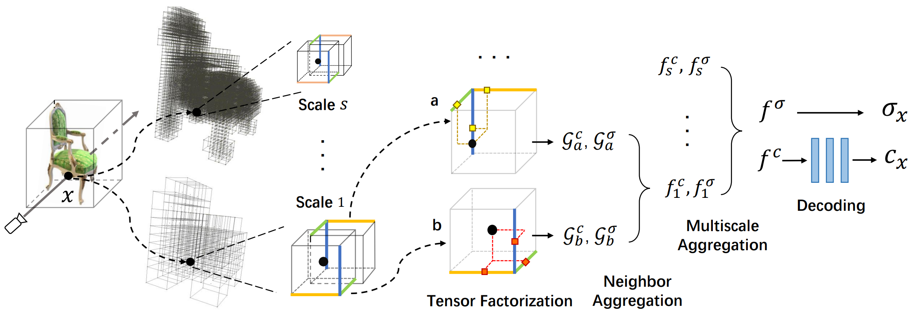
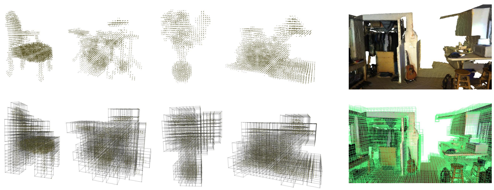
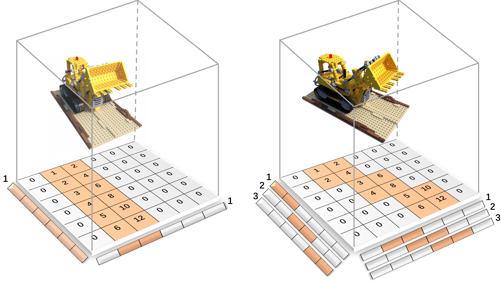

# Strivec: Sparse Tri-Vector Radiance Fields


[Video](https://youtu.be/zQ5Uli553CY)
 | [Paper](https://arxiv.org/abs/2307.13226)



## Overal Instruction
1. We build the initial geometry with the 1st stage of DVGO in our implementation by default, which is `use_geo = -1` in config files.
2. The geometry can be either initialized online (by default) or from other sources in `.txt` form, which can be enabled with `use_geo = 1` and `pointfile = /your/file.txt` in config files.  
3. You may ignore `preprosessing` folder, which is initially for our ealy trying and not used here.
4. You may refer to the comments in `./configs/synthetic-nerf/default/chair.txt` for the usage of hyperparameters. 

For Synthetic-NeRF dataset, we provide the initial geometry from DVGO (which is the default one in our implementation) and from [MVS](https://drive.google.com/file/d/1m6ftmKU4lhxXQZKhkoeeWnC9F85kyMBu/view?usp=sharing). Feel free to try both (e.g., `use_geo = 1` and `pointfile = /your/mvs_file.txt`) to see the comparison. 

For Scannet dataset, we use the initial geometry provided by the dataset itself. We convert the original `.ply` file into `.txt` and you may download from [here](https://drive.google.com/file/d/1QLeHGUwAqEkrZEQPQSDvSSyzViO1ziGY/view?usp=sharing).

## Installation

### Requirements
All the codes are tested in the following environment:
* Linux  18.04+
* Python 3.6+
* PyTorch 1.10+
* CUDA 10.2+ 

## Data Preparation

* [Synthetic-NeRF](https://drive.google.com/drive/folders/128yBriW1IG_3NJ5Rp7APSTZsJqdJdfc1) 
* [Scannet](https://drive.google.com/drive/folders/1GoxJyf_YYEGvWStD7SpcPBqhePqCGpEJ)
* [Tanks&Temples](https://dl.fbaipublicfiles.com/nsvf/dataset/TanksAndTemple.zip)
* [Mip-NeRF360](http://storage.googleapis.com/gresearch/refraw360/360_v2.zip)

And the layout should look like this:

```
Strivec
├── data
│   ├── nerf_synthetic
    │   │   |──default
    │   │   │   |──chair
    │   │   │   │──drums
    │   │   │   |──...
    │   │   |──local_vm
    │   │   │   |──chair
    │   │   │   │──drums
    │   │   │   |──...
    ├── scene0101_04 (scannet)
    │   │   │──exported
    │   │   │──scene0101_04_2d-instance-filt.zip
    │   │   │──...
    ├── scene0241_01 (scannet)
    │   │   │──exported
    │   │   │──scene0241_01_2d-instance-filt.zip
    │   │   │──...
    ├── TanksAndTemple
    │   │   │──Barn
    │   │   │──Caterpillar
    │   │   │──...
    ├── 360 (Mip-NeRF360)
    │   │   │──garden
    │   │   │──room
    │   │   │──...
```

## Training & Evaluation
We not only provide the training and evaluation code to reproduce the results in the paper, but also the code of ablation that uses local VM tensors instead of local CP tensors (results
are [here](https://drive.google.com/drive/folders/1-OW0Qdnk4Wz-9BRr81P2mDe1aYDmjd0g?usp=sharing)).


```
# hierachical Strivec, without rotation (grid aligned)
python train_hier.py --config ./configs/synthetic-nerf/default/chair.txt

# local VM tensors instead of local CP tensors
train_dbasis.py --config ./configs/synthetic-nerf/local_vm/chair.txt

```

## Visualization
We visualize the local tensors of different scales into `./log/your_scene/rot_tensoRF/0_lvl_k.ply`, where k is the kth scale.





## Why our local design is superior than original TensoRF against rotation


Here is a toy example to illustrate the TensoRF-CP (TensoRF-VM is similar) with global decomposition in (left) axis-aligned and (right) non-axis-aligned situations. The bottom shows the grid values.
In axis-aligned case, only 1 component is needed to represent the scene (vector bases recover grid values by outer product). In non-axis-aligned case, however, 3 components
are needed because the rank of matrix changes from 1 to 3 after scene rotation. While our design with local low-rank tensors can alleviate this issue, i.e., local tensors (2*2) are always rank-1 before and after rotation.


## Citation
If you find our code or paper helps, please consider citing:
```
@INPROCEEDINGS{gao2023iCCV,
  author = {Quankai Gao and Qiangeng Xu and Hao Su and Ulrich Neumann and Zexiang Xu},
  title = {Strivec: Sparse Tri-Vector Radiance Fields},
  booktitle = {Proceedings of the IEEE/CVF International Conference on Computer Vision (ICCV)},
  year = {2023}
}
```
